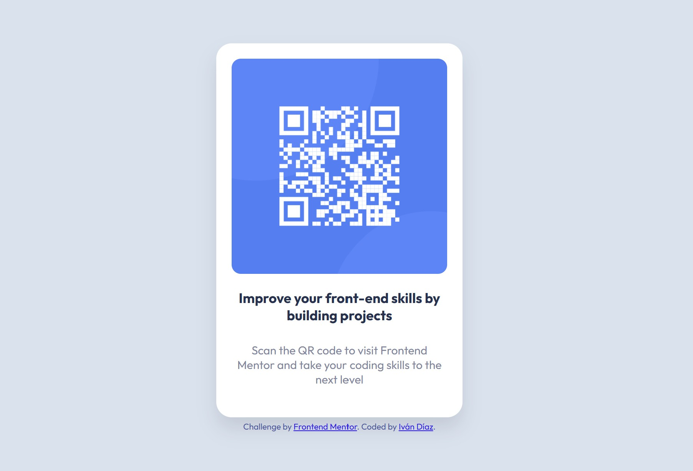

# Frontend Mentor - QR code component solution

This is my solution to the [QR code component challenge on Frontend Mentor](https://www.frontendmentor.io/challenges/qr-code-component-iux_sIO_H). Frontend Mentor challenges help you improve your coding skills by building realistic projects.

## Table of contents

- [Overview](#overview)
  - [Screenshot](#screenshot)
  - [Links](#links)
- [My process](#my-process)
  - [Built with](#built-with)
  - [What I learned](#what-i-learned)
  - [Continued development](#continued-development)
- [Author](#author)

## Overview

### Screenshot



> 📸 Reemplaza `screenshot.jpg` con la captura real del componente terminado.

### Links

- Solution URL: [GitHub Repo](https://github.com/ivandiaz/qr-code-component)
- Live Site URL: [Live demo](https://ivandiaz-qr-code-component.vercel.app)

> 🔗 Reemplaza las URLs si usas otro nombre o plataforma (como Netlify).

## My process

### Built with

- Semantic HTML5 markup
- CSS custom properties
- Flexbox
- Mobile-first workflow
- Google Fonts - [Outfit](https://fonts.google.com/specimen/Outfit)

### What I learned

Este proyecto me sirvió para practicar el centrado de elementos con Flexbox, el uso de `box-shadow`, `border-radius`, y cómo estructurar un componente simple con HTML y CSS. También reforcé el uso de clases reutilizables y el trabajo con fuentes externas desde Google Fonts.

```css
body {
  display: flex;
  justify-content: center;
  align-items: center;
  min-height: 100vh;
}
```
